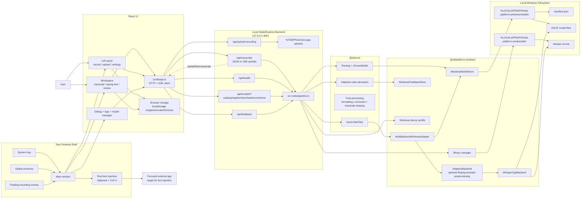
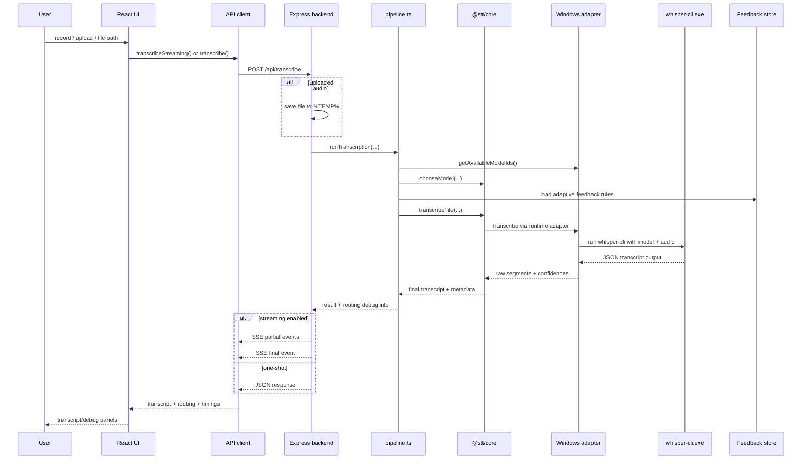

# Spokn Infra Diagram

Current architecture snapshot based on the `windows-test-app`, `@stt/core`, and `@stt/platform-windows` codepaths.

## System Overview

## Transcription Request Flow

## Notes

- This is a fully local/offline architecture in normal transcription flow. There is no cloud STT service in the current path.
- The backend auto-initializes the correct `whisper-cli` binary variant at startup and stores models/binaries under `%LOCALAPPDATA%`.
- Feedback is persisted locally and turned into adaptive rules for later transcription requests.
- Tauri mainly provides native shell features: tray behavior, global shortcuts, floating overlay, and text injection into the focused app.
